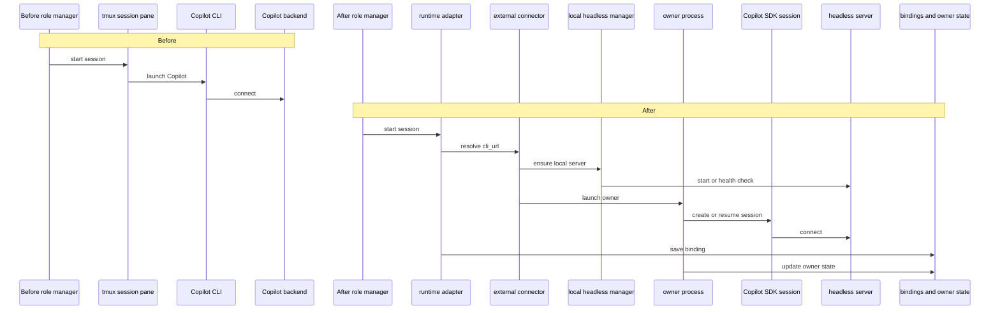

# Copilot External Architecture

Design note for the shift from tmux-bound Copilot sessions to the owner-managed
external runtime used when a role resolves a `cli_url`.

## Scope

This document covers the runtime path used by `copilot-external` and any other
role config that sets `cli_url` in `settings/config.json`.

It complements:

- `docs/copilot-external.md` for operator setup
- `docs/design/architecture.md` for the broader town/rig layout
- `docs/design/mail-architecture.md` for delivery behavior after durable writes

## Before: Direct CLI Session In tmux

Before external runtime support, Copilot fit the same execution shape as other
interactive CLIs: Gas Town launched a session, injected prompts through tmux,
and inferred health from the pane.

```text
Role manager
  -> resolve role runtime
  -> build startup command
  -> create tmux session
  -> launch `copilot` CLI in pane
  -> send startup/work prompts via tmux nudge

tmux pane
  -> is the only live transport
  -> is the only wakeup path
  -> is the only liveness surface GT can inspect
```

### Before Flow

```text
Witness / Refinery / Polecat / Crew
              |
              v
      role-specific manager
              |
              v
        tmux session pane
              |
              v
         `copilot --yolo`
              |
              v
         Copilot backend
```

### Before Constraints

- prompt delivery depended on terminal injection
- readiness and busy/idle state were inferred from tmux behavior
- no durable runtime session ID existed outside the pane lifecycle
- request/reply paths without tmux were awkward or unavailable
- an external headless server was not the architectural center of the flow

## After: Owner-Managed External Runtime

With `cli_url` set, Gas Town stops treating Copilot as just another interactive
pane. The runtime adapter switches to an SDK-backed path with explicit session
bindings and an owner loop.

### After Flow

```text
Witness / Refinery / Polecat / Crew / session smoke
                    |
                    v
          runtime.TmuxSessionAdapter
                    |
                    v
      copilotExternalSessionConnector
          |                     |
          | local cli_url       | any cli_url
          v                     v
  Ensure local headless   Launch owner process
  server if needed        `gt external-copilot-owner`
                                |
                                v
                        Copilot SDK session
                                |
                                v
                   Copilot headless server (`cli_url`)
```



### Control-Plane Artifacts

```text
<town>/.runtime/
  session-bindings/*.json
    - issue/role/agent -> runtime session mapping
    - metadata: external_server, cli_url, owner_mode, owner_pid

  copilot-owner/<session>/
    - config.json
    - status.json
    - owner.log
    - requests/*.json
    - responses/*.json

  copilot-server/
    - state.json
    - copilot-server.log
```

### After Behavior

- role managers still resolve settings, tool policy, and workdir in Gas Town
- `runtime.TmuxSessionAdapter` becomes the boundary for start, resume, and lookup
- `copilotExternalSessionConnector` turns `cli_url` into an explicit external
  trust boundary
- localhost URLs can be Gastown-managed and auto-started if unhealthy
- the owner process holds the live SDK session and services queued send/ask work
- session bindings become the source of truth for reconnecting to the runtime
- mail and nudge paths can target the owner queue even when no tmux session exists

## Before vs After

| Concern | Before | After |
|---|---|---|
| Session transport | tmux pane only | SDK session behind owner loop |
| Runtime identity | tmux session name | persisted runtime session ID + binding |
| Prompt delivery | tmux send-keys | initial SDK send plus owner request queue |
| Headless operation | incidental | first-class |
| No-tmux delivery | weak fallback | owner request queue + binding lookup |
| Local server management | manual | optional Gastown-managed `copilot --headless` |
| State on disk | mostly tmux/runtime heuristics | binding store + owner status/request files |

## Runtime Sequence

### Session Start

```text
role manager
  -> resolve runtime config
  -> ensure hooks/settings
  -> adapter.Start(...)
  -> external connector checks cli_url
  -> optional local server health/start
  -> launch owner process
  -> owner creates or resumes SDK session
  -> adapter saves binding with runtime session ID
```

### Message Delivery After Start

```text
GT mail / gt nudge / gt ask
  -> load binding
  -> detect owner-managed external session
  -> write request file under .runtime/copilot-owner/<session>/requests/
  -> owner loop sends through Copilot SDK session
  -> optional response file for ask/reply flows
```

## Source Files

- `internal/runtime/adapter.go` - adapter boundary, external switch, binding metadata
- `internal/runtime/external_copilot.go` - external connector and managed session
- `internal/runtime/external_owner.go` - owner queue, status files, recovery helpers
- `internal/cmd/external_copilot_owner.go` - long-lived SDK owner loop
- `internal/copilotutil/server.go` - localhost headless server health/start/stop
- `internal/cmd/session_smoke.go` - live create/send/resume/send/stop verification path
- `internal/mail/router.go` - mail fallback to owner-managed delivery
- `internal/cmd/nudge.go` - managed session lookup for non-tmux delivery

## Design Intent

The important architectural change is not just "Copilot can use a URL." It is
that Gas Town now separates:

- role orchestration and policy in GT
- live Copilot conversation ownership in an SDK-backed sidecar process
- server lifecycle in a small, explicit headless-server manager

That split removes tmux from the critical path for headless Copilot sessions
while keeping the existing GT role model, tool policy model, and binding model.
